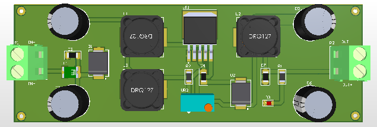

# XL6009 SEPIC DC-DC Converter (Buck-Boost)

A wide-input, high-performance DC-DC converter module utilizing the XL6009 regulator in a SEPIC topology. This allows the module to step-up or step-down voltage automatically, maintaining a stable output even if the input voltage fluctuates above or below the setpoint.

## Functions
*   **Automatic Buck-Boost:** Maintains a fixed output voltage (e.g., 12V) regardless of whether the input is lower (e.g., 9V) or higher (e.g., 15V) than the output. Perfect for automotive or battery applications.
*   **Voltage Regulation:** Adjustable output via precision multiturn potentiometer (VR2).
*   **Power Conditioning:** heavily filtered input and output stages for low-noise operation.

## Technical Highlights (Design Evaluation)

This module features a sophisticated circuit design superior to standard boost converters:

*   **SEPIC Topology:** The inclusion of coupling capacitor **C4 (47µF)** and the dual-inductor configuration (L1/L3) enables true Buck-Boost operation with non-inverted output. This isolates the input from the output, providing DC blocking functionality.
*   **Pi-Filter Output (LC Stage):** Unlike generic modules that rely solely on capacitors, this design includes a secondary LC filter stage (**L2 47µH + C6 470µF**). This drastically reduces the switching ripple (noise) at the output, making it safe for sensitive microcontrollers and sensors.
*   **Robust Input Defense:**
    *   **Fuse (5A):** Physical protection against over-current/short-circuit.
    *   **Schottky Diode (D1 - SS510):** A high-current (5A) diode protects the circuit from reverse polarity connection with minimal voltage drop.
*   **Bulk Capacitance:** Features dual 470µF capacitors on both input and output rails for excellent transient response and stability.

## Specifications
*   **Controller:** XL6009E1.
*   **Input Voltage:** 5V - 32V DC.
*   **Output Voltage:** 1.25V - 35V DC (Adjustable).
*   **Topology:** SEPIC (Buck-Boost).
*   **Switching Frequency:** 400kHz.
*   **Max Current:** ~3A (4A Switch Limit).

## Pinout
| Header | Description |
| :--- | :--- |
| **P1 (IN)** | DC Input (+/-) |
| **P2 (OUT)** | Regulated DC Output (+/-) |
