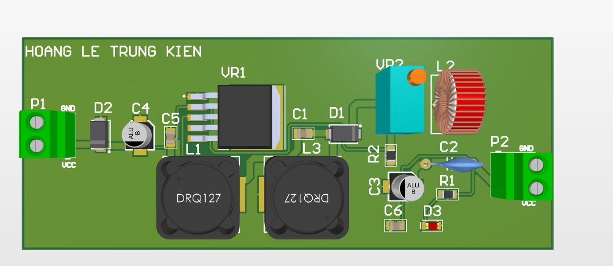

# XL6009 DC-DC Boost Converter

A DC-DC step-up (boost) converter circuit based on the XL6009 chip, capable of converting low input voltages to higher output voltages with adjustable output.

## Features

- **Input Voltage:** Adjustable via VIN (typical 3V-32V)
- **Output Voltage:** Adjustable up to 35V via potentiometer (VR2)
- **Switching Frequency:** High-efficiency switching operation
- **Output Current:** Supports moderate load currents
- **Protection:** Includes reverse polarity protection (D2: 1N4007) and output rectification (D1: SS54C)

## Circuit Components

### Key Components

- **VR1 (XL6009):** Main DC-DC converter IC
- **L1, L3 (33μH):** Input/switching inductors for energy storage
- **L2 (33μH):** Output filter inductor
- **C3 (220μF):** Output filter capacitor
- **C6 (47μF):** Additional output smoothing
- **VR2 (10kΩ):** Output voltage adjustment potentiometer
- **D1 (SS54C):** Schottky rectifier diode
- **D2 (1N4007):** Reverse polarity protection diode
- **D3:** Power indicator LED
- **R2 (330Ω):** LED current limiting resistor

## Pin Configuration

**XL6009 IC Pinout:**

1. GND - Ground
2. EN - Enable (active high)
3. SW - Switching output
4. VIN - Input voltage
5. FB - Feedback for voltage regulation
6. SW - Switching output (duplicate)

## Connections

- **P1 (Header 2):** Input power connector (VIN, GND)
- **P2 (Header 2):** Output power connector (VOUT, GND)

## Board Layout

## Usage

1. Connect input power source (3-32V DC) to P1
2. Adjust VR2 potentiometer to set desired output voltage
3. Connect load to P2 output connector
4. D3 LED indicates power on status

## PCB Design Notes

- Keep switching node traces (SW pins) short and thick
- Place input capacitors (C1, C2) close to VIN pin
- Route feedback network (VR2, R1) away from switching nodes
- Use adequate copper pour for GND plane

## Safety Warnings

⚠️ **Do not exceed maximum ratings:**

- Input voltage: 32V max
- Output voltage: 35V max
- Ensure proper heatsinking for high current applications
- Verify polarity before connecting power

---

**Date:** November 6, 2025  
**Version:** 1.0
